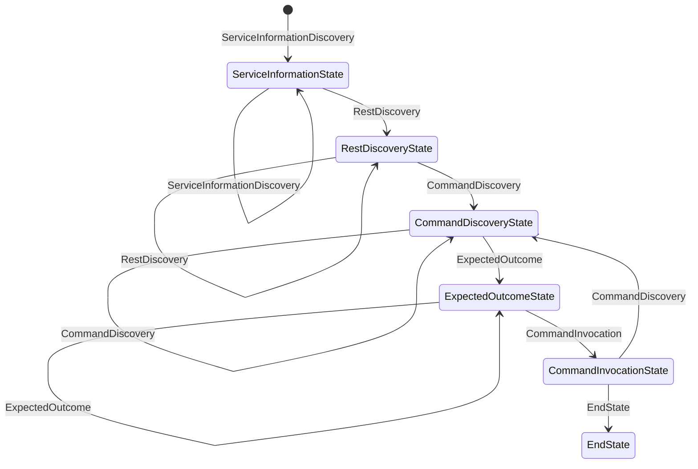

# API Testing State Machine Design

## Overview
This document describes the state machine used in the **ApiTestingAgent** project. The state machine orchestrates various steps in the API testing workflow.

---

## States

### 1. ServiceInformationState
- **Purpose**: Handles the discovery of service information and domain details.
- **Transitions**:
  - `ServiceInformationDiscovery`: Initial transition to set up the service information (self-loop transition if unresolved).
  - `RestDiscovery`: Transition to discover REST APIs if service information is successfully concluded.

### 2. RestDiscoveryState
- **Purpose**: Handles the discovery of REST API endpoints and their details.
- **Transitions**:
  - `RawContentGet`: Fetch raw content from GitHub for further analysis (self-loop transition).
  - `RestDiscovery`: Transition to rediscover REST APIs if unresolved.
  - `CommandDiscovery`: Transition to discover commands if REST API discovery is successfully concluded.

### 3. CommandDiscoveryState
- **Purpose**: Handles the discovery of commands or operations related to the API.
- **Transitions**:
  - `CommandDiscovery`: Loops back to itself if no valid command is found.
  - `ExpectedOutcome`: Transitions to define the expected outcome of a command.

### 4. ExpectedOutcomeState
- **Purpose**: Defines the expected outcome of a command, including HTTP status, error messages, and response content.
- **Transitions**:
  - `ExpectedOutcome`: Loops back to itself if the expected outcome is not concluded.
  - `CommandInvocation`: Transitions to invoke the command once the expected outcome is defined.

### 5. CommandInvocationState
- **Purpose**: Handles the invocation of a confirmed command.
- **Transitions**:
  - `CommandInvocation`: Executes the confirmed command.
  - `EndState`: Transitions to the final state upon successful completion, recording the HTTP method and response content.
  - `CommandDiscovery`: Loops back to `CommandDiscoveryState` if the command execution fails or requires further input.

### 6. EndState
- **Purpose**: Represents the final state of the state machine.
- **Transitions**: Comes directly after `CommandInvocationState` (terminal state).

---

## Transitions

### Defined Transitions
- **ServiceInformationDiscovery**: Initial transition to set up the service information (self-loop if unresolved).
- **RestDiscovery**: Transition to discover REST APIs (self-loop if unresolved).
- **RawContentGet**: Transition to fetch raw content from GitHub.
- **CommandDiscovery**: Transition to discover commands.
- **ExpectedOutcome**: Transition to define the expected outcome of a command.
- **CommandInvocation**: Executes the confirmed command.
- **EndState**: Final state transition after successful command execution.
- **Any**: A wildcard transition that can be used to move to any state.

---

## Criteria for Transitions
- **Success or Failure**: The outcome of the current step determines the next transition.
- **Data Availability**: Required data (e.g., API endpoints, commands) must be available.
- **External Triggers**: Responses from external systems (e.g., GitHub API) may influence transitions.

---

## Diagram

