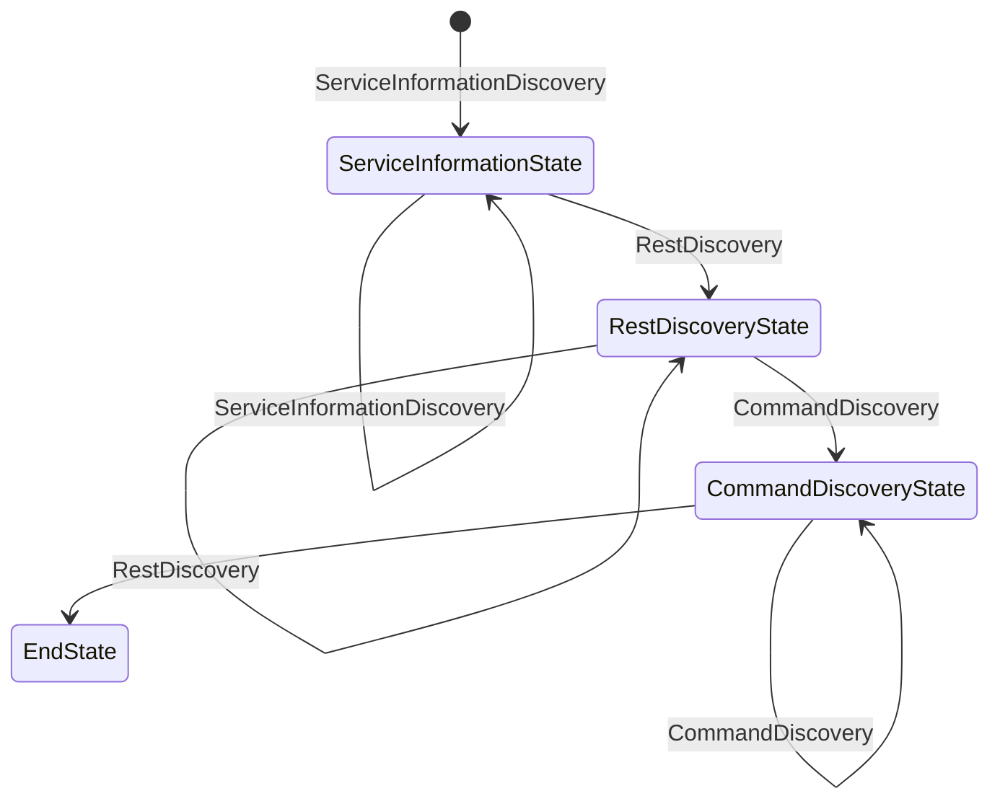

# API Testing State Machine Design

## Overview
This document describes the state machine used in the **ApiTestingAgent** project. The state machine orchestrates various steps in the API testing workflow.

---

## States

### 1. ServiceInformationState
- **Purpose**: Handles the discovery of service information and domain details.
- **Transitions**:
  - `ServiceInformationDiscovery`: Initial transition to set up the service information (self-loop transition if unresolved).
  - `RestDiscovery`: Transition to discover REST APIs.

### 2. RestDiscoveryState
- **Purpose**: Handles the discovery of REST API endpoints.
- **Transitions**:
  - `RawContentGet`: Fetch raw content from GitHub (self-loop transition).
  - `RestDiscovery`: Transition to discover REST APIs (self-loop transition if unresolved).

### 3. CommandDiscoveryState
- **Purpose**: Handles the discovery of commands or operations related to the API.
- **Transitions**:
  - Loops back to itself (`CommandDiscovery`) if no valid command is found.
  - Transitions to `EndState` once a command is successfully discovered.

### 4. EndState
- **Purpose**: Represents the final state of the state machine.
- **Transitions**: Comes directly after `CommandDiscoveryState` (terminal state).

---

## Transitions

### Defined Transitions
- **ServiceInformationDiscovery**: Initial transition to set up the service information (self-loop if unresolved).
- **RestDiscovery**: Transition to discover REST APIs (self-loop if unresolved).
- **RawContentGet**: Transition to fetch raw content from GitHub.
- **CommandDiscovery**: Transition to discover commands.
- **CommandConsent**: Trigger transition to invoke commands (self-loop).
- **CommandConsentApproval**: Transition to approve command invocation.
- **Any**: A wildcard transition that can be used to move to any state.

---

## Criteria for Transitions
- **Success or Failure**: The outcome of the current step determines the next transition.
- **Data Availability**: Required data (e.g., API endpoints, commands) must be available.
- **External Triggers**: Responses from external systems (e.g., GitHub API) may influence transitions.

---

## Diagram

